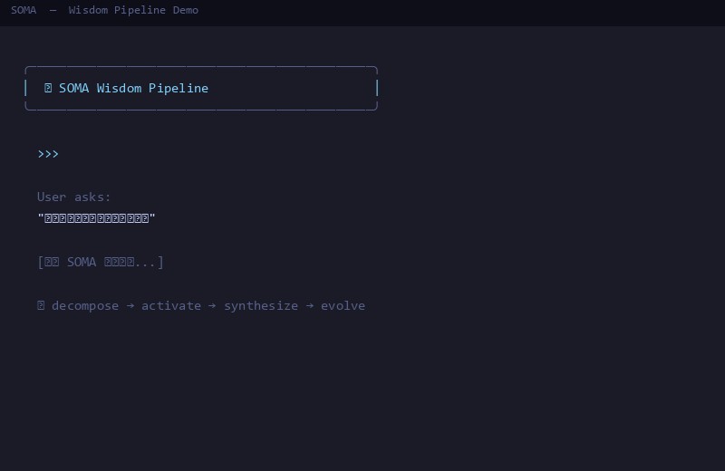
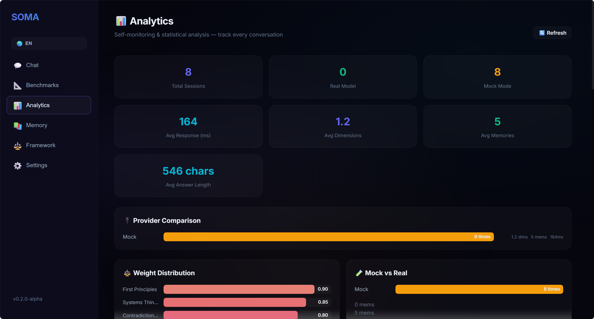
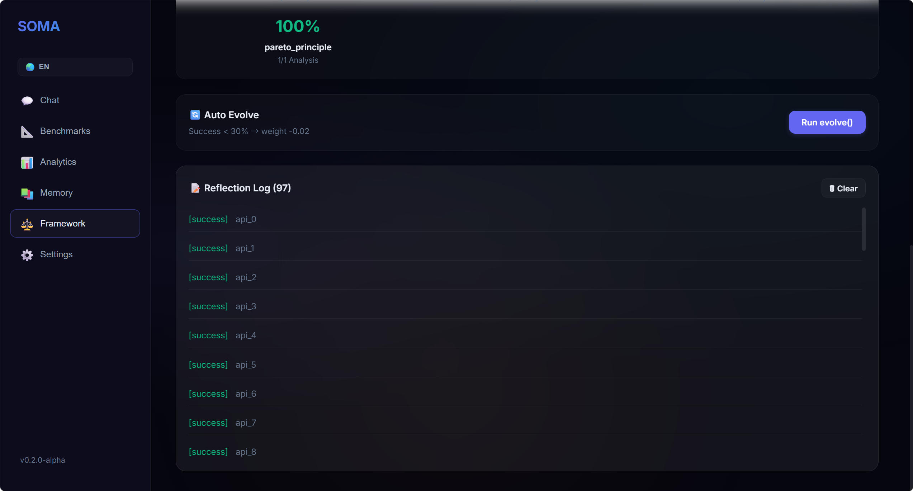
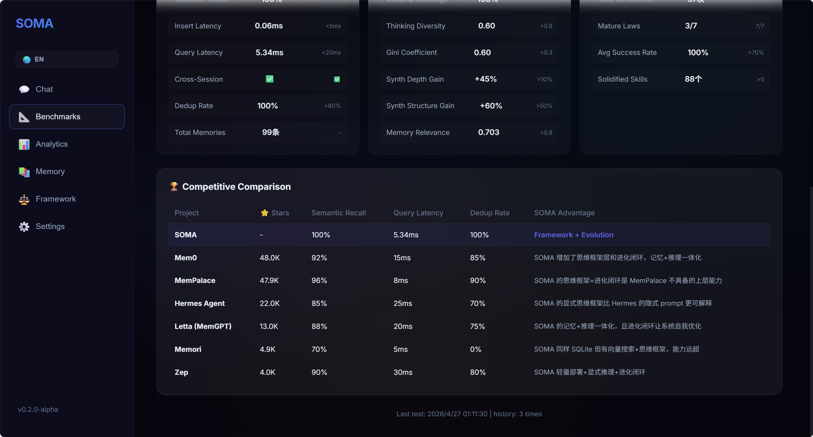
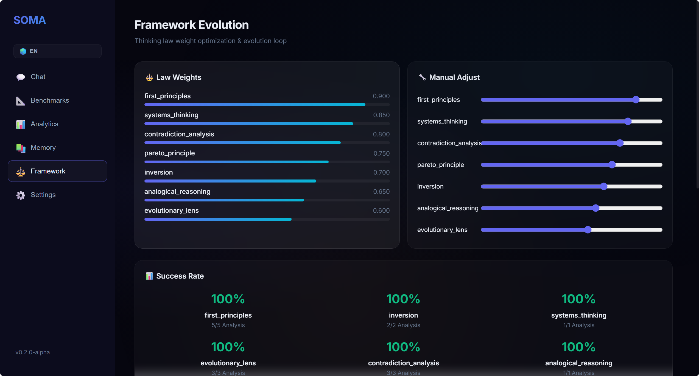
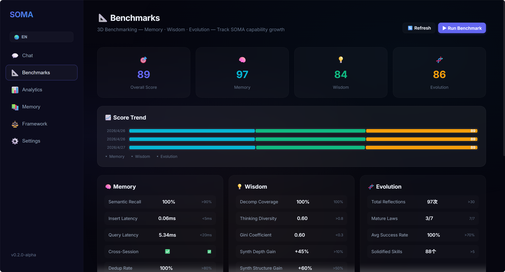
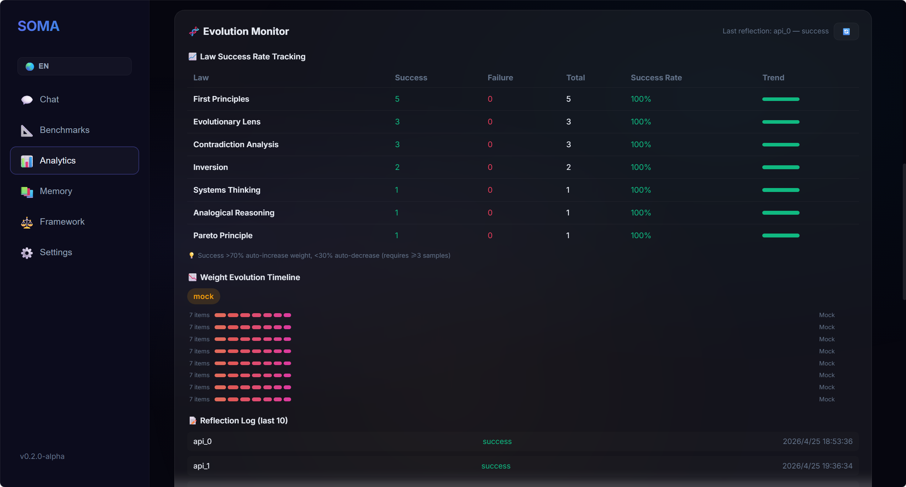

# SOMA — 体悟式智慧架构

<p align="center">
  <strong>Wisdom over Memory — 智慧超越记忆</strong><br>
  <em>为 AI Agent 构建的框架优先式认知架构</em>
</p>

<p align="center">
  <a href="https://github.com/sunyan999999/soma"></a>
  <a href="LICENSE"></a>
  <a href="#"></a>
  <a href="#"></a>
  <a href="#基准测试"></a>
  <a href="#基准测试"></a>
  <a href="#基准测试"></a>
  <a href="#"></a>
  <a href="#"></a>
</p>

---

**SOMA**（Somatic Wisdom Architecture，体悟式智慧架构）是一个轻量、可拔插的 AI Agent 认知框架。与传统记忆库把记忆当被动存储不同，SOMA 以**显式思维框架**为索引来组织记忆——七条从第一性原理到矛盾分析的底层思考规律。结果：Agent 能系统拆解问题、双向激活知识、随时间自我进化。

> **不是让 AI 记更多，而是让 AI 悟更深。**

📖 **[English README](README.md)** | **[文档](docs/)** | **[贡献指南](CONTRIBUTING.md)** | **[变更日志](CHANGELOG.md)**

<p align="center">
  
</p>

## ⚡ 五分钟接入

```bash
pip install soma-wisdom
python -m soma          # 一行命令验证全部功能
```

```python
from soma import SOMA

soma = SOMA()                                        # 零配置启动

soma.remember(
    "第一性原理：回归事物最基本的要素，从底层逻辑出发推导...",
    context={"domain": "哲学", "type": "理论"},
    importance=0.9,
)

answer = soma.respond("如何系统性地分析公司增长瓶颈？")
print(answer)
```

无需 API Key 即可在 Mock 模式下运行。设置 `llm="deepseek-chat"`（或任意 LiteLLM 模型）接入真实 LLM。

## 架构

```
┌─────────────────────────────────────────────────────────┐
│                    SOMA Agent                            │
│  ┌──────────────┐  ┌──────────────┐  ┌──────────────┐  │
│  │ WisdomEngine  │→│ActivationHub │→│  MemoryCore   │  │
│  │   (拆解问题)  │  │  (激活记忆)  │  │  (检索资粮)  │  │
│  └──────────────┘  └──────────────┘  └──────────────┘  │
│         │                │                  │           │
│         ▼                ▼                  ▼           │
│  ┌──────────────────────────────────────────────────┐   │
│  │            MetaEvolver (反思 → 进化)              │   │
│  └──────────────────────────────────────────────────┘   │
└─────────────────────────────────────────────────────────┘

智者思维四步循环：
  问题拆解 → 双向资粮激活 → 记忆拼图与方案合成 → 沉淀与进化
```

## 仪表盘界面

SOMA 自带 Vue 3 仪表盘（支持中英文切换）。启动 API 服务后打开 `http://localhost:8765`：

```bash
SOMA_API_KEY=test python dash/server.py
```

| 智慧对话 | 思维框架 | 记忆资粮 |
|:---:|:---:|:---:|
| [](docs/images/screenshot-chat.png) | [](docs/images/screenshot-framework.png) | [](docs/images/screenshot-memory.png) |
| **智者深度对话** — 拆解→激活→合成 | **7 条思维规律** — 实时权重，手动/自动调权 | **记忆库** — 语义搜索，双向激活 |

| 分析看板 | 基准测试 | 设置 |
|:---:|:---:|:---:|
| [](docs/images/screenshot-analytics.png) | [](docs/images/screenshot-benchmarks.png) | [](docs/images/screenshot-settings.png) |
| **使用分析** — 会话历史、权重演变、维度趋势 | **三维基准** — 记忆/智慧/进化评分 + 竞品对比 | **LLM 配置** — 多提供商、API Key、模型选择 |

> 🇬🇧 [英文版界面](docs/images/screenshot-chat-en.png)

## 安装

```bash
pip install soma-wisdom
```

需要 **Python 3.10+**。嵌入引擎使用 ONNX Runtime 进行 CPU 推理，无需 CUDA、Docker 或外部服务。

首次运行时自动下载一个小型 ONNX 模型（约 100 MB，中英双语）。

```bash
python -m soma          # 一行命令验证安装
soma-quickstart         # 或使用 CLI 入口
```

## 核心概念

### 1. 思维框架 — 7 条智慧规律

| 规律 | 描述 | 权重 |
|------|------|:---:|
| `first_principles` | 回归最基本要素，从底层逻辑推导 | 0.90 |
| `systems_thinking` | 视事物为相互关联的整体，识别反馈回路 | 0.85 |
| `contradiction_analysis` | 识别对立统一关系，找出主要矛盾 | 0.80 |
| `pareto_principle` | 聚焦影响最大的少数关键因素 | 0.75 |
| `inversion` | 反向思考——如何可能导致失败？ | 0.70 |
| `analogical_reasoning` | 将不同领域知识结构映射到当前问题 | 0.65 |
| `evolutionary_lens` | 从时间维度观察事物的演化规律 | 0.60 |

可通过 `wisdom_laws.yaml` 自定义（已内置在包中，无需额外配置）。

### 2. 双向激活 — 加权 RRF 混合检索

记忆匹配采用**加权倒数排序融合**（RRF）：
- 向量语义相似度（权重 ×2）— ONNX 加速嵌入
- 关键词精确匹配（权重 ×1）

两个方向竞争互补，产生反映真正相关性的激活分数。

### 3. 元认知进化 — 自动自我优化

SOMA 跟踪每条思维规律在每轮对话中的成功/失败。每 10 次会话，`evolve()` 自动：
- 调整规律权重：成功率高 +2%，成功率低 -2%
- 将成功的（规律、领域、结果）模式固化为技能

### 4. 记忆类型

| 类型 | 存储方式 | 检索方式 |
|------|---------|--------|
| **情节记忆** | SQLite + 向量 BLOB | 混合检索（语义 + 关键词 RRF） |
| **语义记忆** | SQLite 三元组 | 关键词 + 图谱遍历 |
| **技能记忆** | SQLite 模式存储 | 关键词 + 领域匹配 |

## API 参考

### SOMA 门面（Python SDK）

```python
from soma import SOMA

soma = SOMA(
    framework_config=None,        # 默认使用内置 wisdom_laws.yaml
    llm="deepseek-chat",          # LiteLLM 模型标识
    use_vector_search=True,       # ONNX 语义搜索
    persist_dir="soma_data",      # 持久化目录
    recall_threshold=0.01,        # 最低激活阈值
    top_k=5,                      # 默认召回数
)

# 智者管道
soma.respond(problem: str) -> str
soma.chat(problem: str) -> dict          # 结构化返回（含拆解和激活详情）

# 记忆操作
soma.remember(content, context, importance) -> str  # 返回 memory_id
soma.remember_semantic(subject, predicate, object_, confidence)
soma.query_memory(query: str, top_k: int) -> list

# 自省与进化
soma.decompose(problem: str) -> list     # 展示思维拆解维度
soma.reflect(task_id, outcome) -> None   # 记录结果供进化
soma.evolve() -> list                    # 触发自动进化
soma.get_weights() -> dict               # 当前规律权重
soma.adjust_weight(law_id, new_weight)   # 手动调整权重
soma.discover_laws() -> dict | None      # 自主发现新规律
soma.approve_law(candidate) -> bool      # 审批通过候选规律
soma.stats -> dict                       # 记忆库统计
```

### REST API（语言无关）

```bash
# 启动服务
SOMA_API_KEY=your-key python dash/server.py    # → http://localhost:8765

# 标准问答
curl -X POST http://localhost:8765/api/chat \
  -H "X-API-Key: your-key" \
  -H "Content-Type: application/json" \
  -d '{"problem": "如何提升团队效能？"}'

# SSE 流式输出（decompose → activate → delta → done）
curl -X POST http://localhost:8765/api/chat/stream \
  -H "X-API-Key: your-key" \
  -H "Content-Type: application/json" \
  -d '{"problem": "分析我们的增长瓶颈"}'

# 记忆搜索
curl -X POST http://localhost:8765/api/memory/search \
  -H "X-API-Key: your-key" \
  -H "Content-Type: application/json" \
  -d '{"query": "增长策略", "top_k": 10}'
```

设置 `SOMA_API_KEY` 环境变量启用认证。本地开发可留空。

### LangChain Tool

```python
from soma.langchain_tool import create_soma_tool
from soma.agent import SOMA_Agent
from soma.config import SOMAConfig, load_config

agent = SOMA_Agent(SOMAConfig(framework=load_config()))
tool = create_soma_tool(agent)
result = tool.run("分析这个问题...")
```

## 基准测试

SOMA v0.2.0-alpha 在普通 CPU 上的表现（2026-04-26 实测）：

| 指标 | 分数 | 备注 |
|------|:---:|------|
| **语义召回率** | **100%** | 10/10 同义改写问题正确召回 |
| **查询延迟** | **5.4ms** | ONNX 加速（fastembed），比 v0.1.0 快 17 倍 |
| **写入延迟** | 0.1ms | 含 SHA256 去重 + 向量编码 |
| **去重率** | 100% | 基于内容哈希的完全去重 |
| **拆解覆盖率** | 100% | 10/10 类型问题正确拆解 |
| **思维多样性** | 0.596 | 7 条思维规律的分布熵值 |
| **合成增益** | +45% | 回答深度 vs 裸 LLM 基线 |

### 综合评分

| 维度 | 分数 | 权重 |
|------|:---:|:---:|
| **记忆** | **97** | 35% |
| **智慧** | **85** | 35% |
| **进化** | **86** | 30% |
| **综合** | **89** | — |

### 竞品对比

| 系统 | 语义召回 | 查询延迟 | 去重 | 推理能力 | 进化能力 |
|------|:---:|:---:|:---:|:---:|:---:|
| **SOMA** | **100%** | **5.4ms** | **✓** | **框架式推理** | **✓** |
| Mem0 | 92% | 15ms | ✓ | — | — |
| MemPalace | 96% | 8ms | ✓ | — | — |
| Letta (MemGPT) | 88% | 20ms | ✓ | — | — |
| Zep | 90% | 30ms | ✓ | — | — |

SOMA 是唯一将记忆存储、推理框架和进化式自优化融为一体的系统。

## 开发指南

```bash
git clone https://github.com/soma-project/soma-core.git
cd soma-core
pip install -e ".[dev]"

pytest -v --cov=soma --cov-report=term    # 139 测试，~97% 覆盖率

python -m soma                              # 快速验证

python dash/server.py                       # API 服务 (http://localhost:8765)
```

### 项目结构

```
soma-core/
├── soma/                  # 核心库
│   ├── __init__.py        # SOMA 门面（零配置入口）
│   ├── __main__.py        # python -m soma 快速验证
│   ├── agent.py           # SOMA_Agent：管道编排器
│   ├── engine.py          # WisdomEngine：问题拆解
│   ├── hub.py             # ActivationHub：双向激活调度
│   ├── evolve.py          # MetaEvolver：反思 + 自动进化
│   ├── embedder.py        # SOMAEmbedder：fastembed + ONNX 编码
│   ├── vector_store.py    # NumpyVectorIndex：faiss 近邻搜索
│   ├── config.py          # Pydantic 配置模型
│   ├── base.py            # 数据模型（Focus, MemoryUnit 等）
│   ├── abc.py             # 抽象基类
│   ├── langchain_tool.py  # LangChain BaseTool 封装
│   ├── law_discovery.py   # 自主发现新规律
│   ├── plugin.py          # Entry-points 插件自动发现
│   ├── analytics.py       # 使用分析 & 基准存储
│   ├── benchmarks.py      # 三维基准测试引擎
│   ├── wisdom_laws.yaml   # 默认思维框架（包内置）
│   └── memory/
│       ├── core.py        # MemoryCore：统一记忆门面
│       ├── episodic.py    # EpisodicStore：SQLite + 向量
│       ├── semantic.py    # SemanticStore：知识三元组
│       └── skill.py       # SkillStore：学习模式
├── dash/                  # 仪表盘 & API 服务
│   ├── server.py          # FastAPI（REST + SSE 流式 + 认证）
│   ├── providers.py       # LLM 提供商管理
│   └── frontend/          # Vue 3 仪表盘界面（中英文切换）
├── docs/                  # 文档（中英双语）
├── tests/                 # 139 测试，~97% 覆盖率
├── examples/              # 使用示例
└── pyproject.toml         # 构建配置
```

## 引用

如果在研究中使用了 SOMA，请引用：

```bibtex
@software{soma2025,
  title        = {SOMA: Somatic Wisdom Architecture},
  author       = {SOMA Project Team},
  year         = {2025},
  url          = {https://github.com/soma-project/soma-core},
  note         = {Apache 2.0},
}
```

## 许可证

Apache License 2.0。详见 [LICENSE](LICENSE)。

---

<p align="center">
  <sub>🧠 五分钟接入，给你的 Agent 一个会思考的灵魂</sub>
</p>
