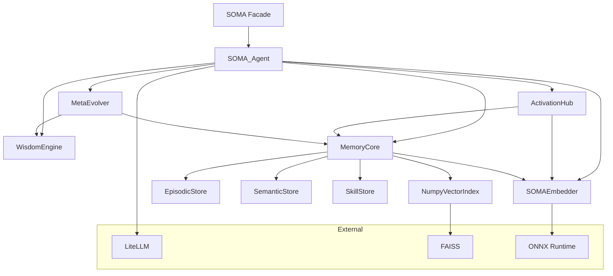

# Architecture

## Module Dependency Map



## Data Flow: The Complete Pipeline

```
User calls soma.respond(problem)

┌─ Step 1: DECOMPOSE ─────────────────────────────────────┐
│ WisdomEngine.decompose(problem)                          │
│   ├─ jieba tokenization + stopword filter                │
│   ├─ Match triggers against 7 laws                       │
│   ├─ No match → default to highest-weight law            │
│   └─ Return: List[Focus] sorted by weight desc           │
│         Focus(law_id, dimension, keywords, weight,       │
│                rationale)                                │
└──────────────────────────────────────────────────────────┘
                          ↓
┌─ Step 2: ACTIVATE ───────────────────────────────────────┐
│ ActivationHub.activate(foci)                             │
│   For each Focus:                                        │
│     ├─ Semantic search (top-down):                       │
│     │   Embed query → FAISS ANN → cosine top-K           │
│     │   Weight: ×2 in RRF fusion                         │
│     ├─ Keyword search (bottom-up):                       │
│     │   Match focus.keywords against memory content      │
│     │   Weight: ×1 in RRF fusion                         │
│     └─ Weighted RRF merge + threshold filter             │
│   Return: List[ActivatedMemory] sorted by activation_score│
│         ActivatedMemory(memory, source, activation_score)│
└──────────────────────────────────────────────────────────┘
                          ↓
┌─ Step 3: SYNTHESIZE ─────────────────────────────────────┐
│ SOMA_Agent._build_prompt(problem, foci, memories)        │
│   ├─ Section 1: Framework context (law lenses)           │
│   ├─ Section 2: Memory nourishment (activated memories)  │
│   ├─ Section 3: Current problem                          │
│   └─ Section 4: Instructions (structured reasoning)      │
│                                                          │
│ SOMA_Agent._call_llm(prompt)                             │
│   └─ LiteLLM completion(model, messages, temperature)    │
│                                                          │
│ Return: answer string                                    │
└──────────────────────────────────────────────────────────┘
                          ↓
┌─ Step 4: EVOLVE ─────────────────────────────────────────┐
│ SOMA_Agent.reflect(task_id, outcome)                     │
│   └─ MetaEvolver.reflect(): record (law_ids, outcome)    │
│                                                          │
│ Every 10 sessions:                                       │
│   MetaEvolver.evolve()                                   │
│     ├─ Calculate success rate per law                    │
│     ├─ High success → weight +2%                         │
│     ├─ Low success → weight -2%                          │
│     └─ Solidify patterns → SkillStore                    │
└──────────────────────────────────────────────────────────┘
```

## Class Relationships

```
SOMA (facade)
 └─ SOMA_Agent (orchestrator)
      ├─ WisdomEngine
      │    └─ List[WisdomLaw]  (from wisdom_laws.yaml)
      │         law_id, name, description, weight, triggers[], relations[]
      │
      ├─ ActivationHub
      │    ├─ MemoryCore (reference)
      │    ├─ top_k: int
      │    └─ threshold: float
      │
      ├─ MemoryCore
      │    ├─ EpisodicStore     → SQLite + FAISS vectors
      │    ├─ SemanticStore     → SQLite triples
      │    ├─ SkillStore        → SQLite patterns
      │    └─ SOMAEmbedder      → ONNX fastembed
      │
      ├─ MetaEvolver
      │    ├─ WisdomEngine (reference, for weight mutation)
      │    ├─ MemoryCore (reference, for skill persistence)
      │    └─ _history: List[SessionRecord]
      │
      └─ SOMAEmbedder
           └─ fastembed.TextEmbedding  (ONNX runtime)
```

## Database Schema

### Episodic Memories (`episodic_memories`)

| Column | Type | Description |
|--------|------|-------------|
| id | TEXT PK | UUID |
| content | TEXT | Memory text content |
| content_hash | TEXT | SHA256 for dedup |
| timestamp | REAL | Unix timestamp |
| importance | REAL | 0.0–1.0 |
| access_count | INTEGER | Activation count |
| context_json | TEXT | JSON metadata |
| memory_type | TEXT | 'episodic' |

Index: `(timestamp DESC)`

### Semantic Triples (`semantic_triples`)

| Column | Type | Description |
|--------|------|-------------|
| id | INTEGER PK | Auto-increment |
| subject | TEXT | Entity A |
| predicate | TEXT | Relationship |
| object | TEXT | Entity B |
| confidence | REAL | 0.0–1.0 |
| created_at | REAL | Unix timestamp |

Indexes: `(subject)`, `(object)`

### Skills (`skills`)

| Column | Type | Description |
|--------|------|-------------|
| id | TEXT PK | UUID |
| name | TEXT | Skill name |
| pattern | TEXT | Pattern description |
| context_json | TEXT | Domain + outcome metadata |
| created_at | REAL | Unix timestamp |

Index: `(created_at DESC)`

### Vector Index

In-memory FAISS `IndexFlatIP` (inner product). Rebuilt on startup from episodic store vectors. Vectors are stored alongside episodic rows for persistence.

## Project Structure

```
soma-core/
├── soma/                    # Core library
│   ├── __init__.py          # SOMA facade (zero-config entry)
│   ├── __main__.py          # python -m soma verification
│   ├── agent.py             # SOMA_Agent: pipeline orchestrator
│   ├── engine.py            # WisdomEngine: problem decomposition
│   ├── hub.py               # ActivationHub: bidirectional activation
│   ├── evolve.py            # MetaEvolver: reflection + evolution
│   ├── embedder.py          # SOMAEmbedder: fastembed + ONNX
│   ├── vector_store.py      # NumpyVectorIndex: FAISS ANN
│   ├── config.py            # Pydantic configuration models
│   ├── base.py              # Data models (Focus, MemoryUnit, etc.)
│   ├── abc.py               # Abstract base classes
│   ├── langchain_tool.py    # LangChain BaseTool wrapper
│   ├── analytics.py         # Usage analytics storage
│   ├── benchmarks.py        # 3D benchmark engine
│   ├── wisdom_laws.yaml     # Built-in thinking framework
│   └── memory/
│       ├── core.py          # MemoryCore: unified memory facade
│       ├── episodic.py      # EpisodicStore: SQLite + vectors
│       ├── semantic.py      # SemanticStore: knowledge triples
│       └── skill.py         # SkillStore: learned patterns
├── dash/                    # Dashboard & API server
│   ├── server.py            # FastAPI (REST + SSE streaming)
│   ├── providers.py         # LLM provider manager
│   └── frontend/            # Vue 3 dashboard UI
├── tests/                   # 132 tests, ~97% coverage
├── examples/                # Usage examples
├── scripts/                 # Benchmarks & data import scripts
├── docs/                    # Documentation (you are here)
├── wisdom_laws.yaml         # Default framework config
└── pyproject.toml           # Build configuration
```

## Key Design Decisions

**SQLite over ChromaDB**: The original spec called for ChromaDB, but SQLite was chosen for zero-dependency deployment. Vector search is handled by FAISS in-process. This means no Docker, no server process, no network calls — a single `pip install` is all that's needed.

**ONNX over API-based embeddings**: Using ONNX Runtime with fastembed models eliminates the OpenAI embedding API dependency. Embeddings run on CPU, cross-platform, with < 6ms latency.

**weighted RRF over pure vector search**: Pure vector similarity can miss keyword-specific matches. The hybrid RRF approach (semantic ×2 + keyword ×1) captures both semantic similarity and exact term relevance.

**Append-only evolution over destructive mutation**: MetaEvolver never deletes data. It records session history, calculates trends, and adjusts weights — but old states are recoverable.
