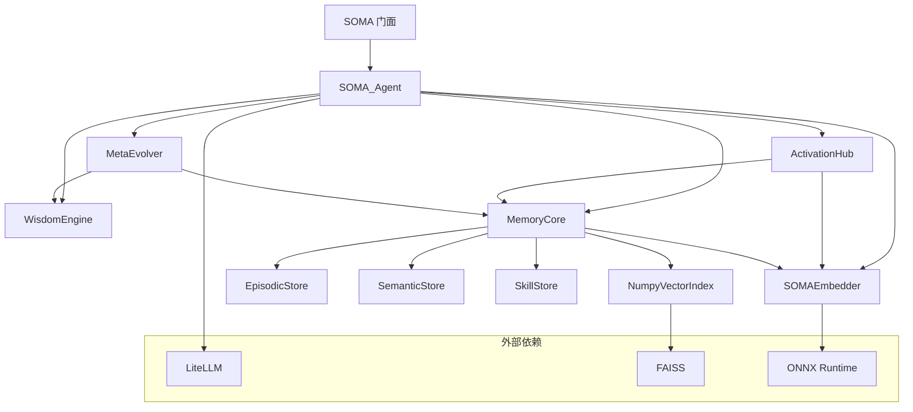

# 架构手册

## 模块依赖图



## 数据流：完整管道

```
用户调用 soma.respond(problem)

┌─ 第1步：拆解 ────────────────────────────────────────────┐
│ WisdomEngine.decompose(problem)                          │
│   ├─ jieba 分词 + 停用词过滤                              │
│   ├─ 匹配 7 条规律的触发词                                │
│   ├─ 无匹配 → 默认使用最高权重规律                        │
│   └─ 返回: List[Focus] 按权重降序                        │
│         Focus(law_id, dimension, keywords, weight,       │
│               rationale)                                 │
└──────────────────────────────────────────────────────────┘
                          ↓
┌─ 第2步：双向激活 ────────────────────────────────────────┐
│ ActivationHub.activate(foci)                             │
│   对每个 Focus:                                          │
│     ├─ 语义搜索（自上而下）:                              │
│     │   嵌入查询 → FAISS ANN → cosine Top-K              │
│     │   RRF 权重: ×2                                     │
│     ├─ 关键词搜索（自下而上）:                            │
│     │   匹配 focus.keywords 与记忆内容                    │
│     │   RRF 权重: ×1                                     │
│     └─ 加权 RRF 融合 + 阈值过滤                          │
│   返回: List[ActivatedMemory] 按激活分数排序              │
│         ActivatedMemory(memory, source, activation_score)│
└──────────────────────────────────────────────────────────┘
                          ↓
┌─ 第3步：合成 ────────────────────────────────────────────┐
│ SOMA_Agent._build_prompt(problem, foci, memories)        │
│   ├─ 第一部分: 框架上下文（思维透镜）                     │
│   ├─ 第二部分: 记忆资粮（激活的记忆）                     │
│   ├─ 第三部分: 当前问题                                  │
│   └─ 第四部分: 指令（结构化推理要求）                     │
│                                                          │
│ SOMA_Agent._call_llm(prompt)                             │
│   └─ LiteLLM completion(model, messages, temperature)    │
│                                                          │
│ 返回: answer 字符串                                       │
└──────────────────────────────────────────────────────────┘
                          ↓
┌─ 第4步：进化 ────────────────────────────────────────────┐
│ SOMA_Agent.reflect(task_id, outcome)                     │
│   └─ MetaEvolver.reflect(): 记录 (law_ids, outcome)      │
│                                                          │
│ 每 10 次会话:                                            │
│   MetaEvolver.evolve()                                   │
│     ├─ 计算每条规律的成功率                               │
│     ├─ 高成功率 → 权重 +2%                               │
│     ├─ 低成功率 → 权重 -2%                               │
│     └─ 固化模式 → SkillStore                             │
└──────────────────────────────────────────────────────────┘
```

## 类关系

```
SOMA (门面)
 └─ SOMA_Agent (编排器)
      ├─ WisdomEngine
      │    └─ List[WisdomLaw]  (来自 wisdom_laws.yaml)
      │         law_id, name, description, weight, triggers[], relations[]
      │
      ├─ ActivationHub
      │    ├─ MemoryCore (引用)
      │    ├─ top_k: int
      │    └─ threshold: float
      │
      ├─ MemoryCore
      │    ├─ EpisodicStore     → SQLite + FAISS 向量
      │    ├─ SemanticStore     → SQLite 三元组
      │    ├─ SkillStore        → SQLite 模式
      │    └─ SOMAEmbedder      → ONNX fastembed
      │
      ├─ MetaEvolver
      │    ├─ WisdomEngine (引用, 用于权重变更)
      │    ├─ MemoryCore (引用, 用于技能持久化)
      │    └─ _history: List[SessionRecord]
      │
      └─ SOMAEmbedder
           └─ fastembed.TextEmbedding  (ONNX 运行时)
```

## 数据库 Schema

### 情节记忆 (`episodic_memories`)

| 列名 | 类型 | 说明 |
|------|------|------|
| id | TEXT PK | UUID |
| content | TEXT | 记忆文本内容 |
| content_hash | TEXT | SHA256 去重哈希 |
| timestamp | REAL | Unix 时间戳 |
| importance | REAL | 0.0–1.0 |
| access_count | INTEGER | 激活次数 |
| context_json | TEXT | JSON 元数据 |
| memory_type | TEXT | 'episodic' |

索引: `(timestamp DESC)`

### 语义三元组 (`semantic_triples`)

| 列名 | 类型 | 说明 |
|------|------|------|
| id | INTEGER PK | 自增 |
| subject | TEXT | 实体 A |
| predicate | TEXT | 关系 |
| object | TEXT | 实体 B |
| confidence | REAL | 0.0–1.0 |
| created_at | REAL | Unix 时间戳 |

索引: `(subject)`, `(object)`

### 技能 (`skills`)

| 列名 | 类型 | 说明 |
|------|------|------|
| id | TEXT PK | UUID |
| name | TEXT | 技能名称 |
| pattern | TEXT | 模式描述 |
| context_json | TEXT | 领域+结果元数据 |
| created_at | REAL | Unix 时间戳 |

索引: `(created_at DESC)`

### 向量索引

内存 FAISS `IndexFlatIP`（内积）。启动时从情节存储的向量重建。向量与情节行一起持久化存储。

## 项目结构

```
soma-core/
├── soma/                    # 核心库
│   ├── __init__.py          # SOMA 门面（零配置入口）
│   ├── __main__.py          # python -m soma 快速验证
│   ├── agent.py             # SOMA_Agent: 管道编排器
│   ├── engine.py            # WisdomEngine: 问题拆解
│   ├── hub.py               # ActivationHub: 门面 re-export（向后兼容）
│   ├── hub/                  # 激活调度子包（三段式管道）
│   │   ├── _core.py          #   ActivationHub 门面编排
│   │   ├── _retriever.py     #   MemoryRetriever: 多路召回
│   │   ├── _scorer.py        #   RelevanceScorer: 相关性打分
│   │   └── _ranker.py        #   MMRRanker: 多样性重排
│   ├── evolve.py            # MetaEvolver: 反思 + 自动进化
│   ├── embedder.py          # SOMAEmbedder: fastembed + ONNX
│   ├── vector_store.py      # NumpyVectorIndex: FAISS 近邻搜索
│   ├── config.py            # Pydantic 配置模型
│   ├── base.py              # 数据模型 (Focus, MemoryUnit 等)
│   ├── abc.py               # 抽象基类
│   ├── langchain_tool.py    # LangChain BaseTool 封装
│   ├── analytics.py         # 使用分析存储
│   ├── benchmarks.py        # 3D 基准测试引擎
│   ├── wisdom_laws.yaml     # 内置思维框架
│   └── memory/
│       ├── core.py          # MemoryCore: 统一记忆门面
│       ├── episodic.py      # EpisodicStore: SQLite + 向量
│       ├── semantic.py      # SemanticStore: 知识三元组
│       └── skill.py         # SkillStore: 学习模式
├── dash/                    # 仪表盘 & API 服务
│   ├── server.py            # FastAPI (REST + SSE 流式)
│   ├── providers.py         # LLM 提供商管理
│   └── frontend/            # Vue 3 仪表盘界面
├── tests/                   # 132 测试, ~97% 覆盖率
├── examples/                # 使用示例
├── scripts/                 # 基准测试 & 数据导入脚本
├── docs/                    # 文档（你在这里）
├── wisdom_laws.yaml         # 默认思维框架配置
└── pyproject.toml           # 构建配置
```

## 关键设计决策

**SQLite 替代 ChromaDB**：原始设计指定 ChromaDB，但选择 SQLite 以实现零依赖部署。向量搜索由 FAISS 进程内处理。这意味着无需 Docker、无需服务进程、无需网络调用——一个 `pip install` 即可。

**ONNX 替代 API 嵌入**：使用 ONNX Runtime 配合 fastembed 模型，消除了对 OpenAI 嵌入 API 的依赖。嵌入在 CPU 上运行，跨平台，延迟低于 6ms。

**加权 RRF 替代纯向量搜索**：纯向量相似度可能遗漏关键词特定匹配。混合 RRF 方法（语义 ×2 + 关键词 ×1）同时捕获语义相似度和精确词匹配。

**追加式进化替代破坏性变更**：MetaEvolver 从不删除数据。它记录会话历史，计算趋势，调整权重——但旧状态可恢复。
